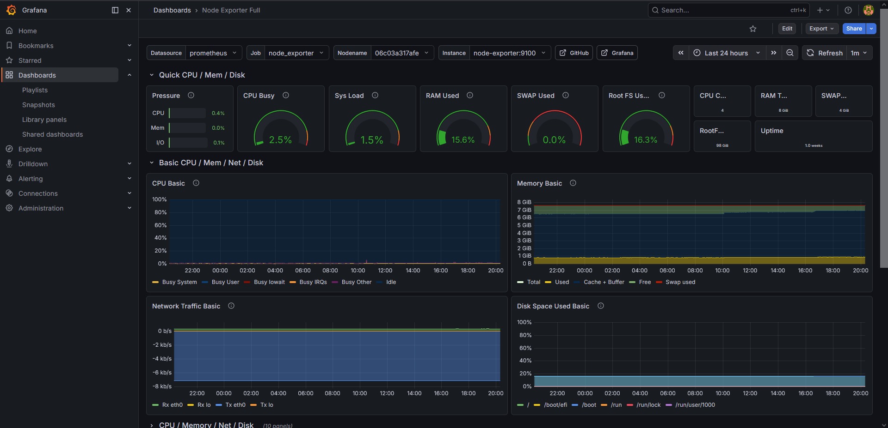
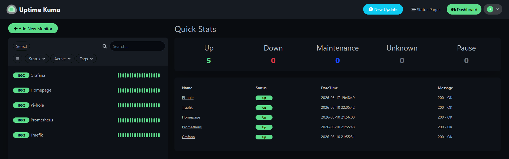
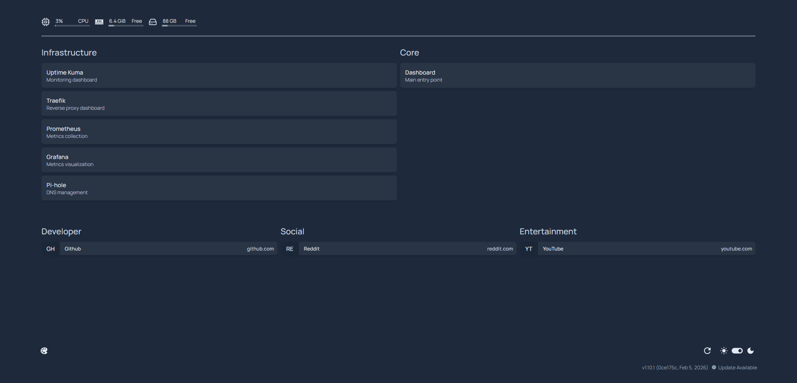

# T430 Homelab Infrastructure

A self-hosted, production-style homelab built on Ubuntu Server using Docker, Traefik, Pi-hole, and Tailscale.

This system simulates real-world infrastructure by implementing secure remote access (VPN-only), centralized DNS, reverse-proxied services, and full observability with Prometheus and Grafana — all without exposing services to the public internet.

---

## Objectives

- Develop hands-on DevOps and infrastructure skills
- Practice containerization and service architecture
- Implement secure access patterns without public exposure
- Maintain production-style documentation and operational discipline
- Build a resume-ready infrastructure project

---

## Architecture

```
Client → Tailscale → Pi-hole (DNS) → Traefik → Docker Services
                                      ↓
                                Prometheus → Grafana
                                      ↓
                                   Uptime Kuma
```

---

## Screenshots

### Grafana Dashboard


### Uptime Kuma Monitoring


### Service Dashboard


### Physical System


---

## System Capabilities

- Containerized service platform using Docker
- Reverse proxy routing with Traefik (host-based routing)
- Centralized DNS using Pi-hole for `.home.lab` domains
- Secure remote access via Tailscale VPN (zero public exposure)
- ACL-based multi-user access control model
- Full observability stack (Prometheus, Grafana, Node Exporter)
- Service uptime monitoring with Uptime Kuma
- Central dashboard for service discovery (Homepage)

---

## Key Design Decisions

- No public port forwarding; all access is secured through Tailscale VPN
- Internal DNS enables clean service access via `.home.lab` domains
- Reverse proxy centralizes routing and removes the need for direct port exposure
- Monitoring uses internal Docker networking instead of LAN or VPN IPs for stability
- Tailscale ACLs enforce least-privilege access for shared users
- Services are only exposed through controlled entrypoints (Traefik on ports 80/443)

---

## Challenges & Learning

- Designed a secure access model using Tailscale ACLs instead of exposing services via port forwarding
- Debugged service routing and DNS resolution across Docker, Pi-hole, and Traefik layers
- Learned to use internal container networking for stable monitoring instead of relying on host/VPN IPs
- Balanced usability (clean `.home.lab` domains) with security constraints (no public exposure)

---

## Technologies

- Docker / Docker Compose
- Traefik (Reverse Proxy)
- Pi-hole (DNS)
- Tailscale (VPN + ACLs)
- Prometheus (Metrics collection)
- Grafana (Metrics visualization)
- Node Exporter (Host metrics)
- Uptime Kuma (Service monitoring)
- Ubuntu Server 24.04 LTS

---

## Core Services

| Service     | Purpose                    | Access                       |
|------------|--------------------------|-----------------------------|
| Homepage   | Central dashboard         | http://dash.home.lab        |
| Uptime Kuma| Service monitoring        | http://kuma.home.lab        |
| Traefik    | Reverse proxy             | http://traefik.home.lab     |
| Prometheus | Metrics collection        | http://prom.home.lab        |
| Grafana    | Metrics visualization     | http://grafana.home.lab     |
| Pi-hole    | DNS management            | http://pihole.home.lab/admin|

---

## Security Model

- All services are private and not exposed to the public internet
- Access is restricted through Tailscale VPN
- ACL-based permissions:
  - Admin users: full access
  - Restricted users: web services + DNS only
- SSH access limited to authorized users only
- Direct container ports are not exposed to shared users

---

## Monitoring Strategy

- Prometheus collects system and service metrics
- Grafana provides visualization dashboards
- Uptime Kuma performs service-level health checks
- Monitoring uses internal container networking for reliability

---

## Hardware

- Lenovo ThinkPad T430
- Intel i5-3320M (2C / 4T)
- 8GB RAM
- 250GB SSD
- Ethernet connection (enp0s25)

---

## Documentation

Detailed infrastructure and operational records are maintained in:

`/docs/infrastructure.md`

Server-side change log:

`~/homelab/docs/changes.log`

---

## Current Status

Core platform established and stable.

The system provides:

- Secure remote access via VPN
- Centralized DNS and service routing
- Containerized service deployment
- Integrated monitoring and observability
- Multi-user access with enforced restrictions

---

## Next Steps

- Implement internal HTTPS / TLS for all services
- Introduce backup strategy for service data
- Add container management tooling (e.g., Portainer)
- Expand service offerings through Traefik routing
