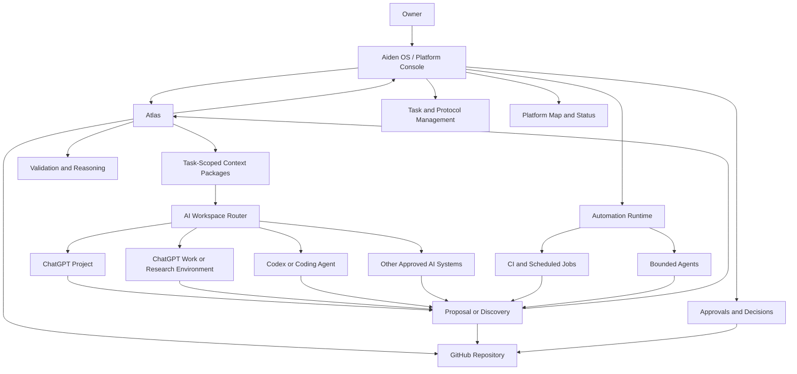
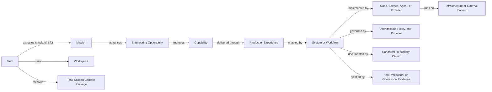

# Aiden Platform Operating Model and Human Control Surface

**Architecture Discovery and Future Checkpoint Report**  
**Date:** July 17, 2026  
**Status:** Discovery synthesis and proposed future architecture  
**Authorization:** No implementation authorized  
**Active-work boundary:** This report does not modify, expand, replace, or advance EO-2026-013.

---

## 1. Purpose

This report consolidates the July 17, 2026 discussion about:

- rapidly improving frontier AI and agent capabilities
- repository-wide analysis, simplification, and refactoring
- ChatGPT Work and other specialized AI workspaces
- reusable agent skills and external AI capability monitoring
- the growing difficulty of understanding the Aiden Platform through repository and CLI views alone
- the need for explicit development protocols
- an interactive human-facing platform map or console
- safe future unattended engineering
- the transition between thinking in ChatGPT and making durable repository changes

The report converts those observations into an evidence-backed architecture finding, a proposed platform model, and one bounded future checkpoint for later repository processing.

It is not a final architecture decision. It is intended to support future Engineering Opportunity review and owner acceptance.

---

## 2. Executive Finding

The Aiden Platform has developed a strong engineering backend:

- GitHub is the canonical engineering record.
- Atlas provides deterministic repository knowledge and reasoning.
- Engineering sessions follow explicit startup, verification, documentation, synchronization, commit, and push expectations.
- AI systems assist with reasoning, research, implementation, and review.
- Engineering Opportunities and missions preserve planned work.

However, the platform does not yet provide a sufficiently clear human operating model or control surface.

The owner can inspect files, CLI output, review bundles, and AI conversations, but must still reconstruct the following mentally:

- what the full platform currently contains
- what is implemented, experimental, planned, deprecated, or unclear
- why each major system or document exists
- how capabilities, code, documentation, infrastructure, agents, and workflows relate
- what work is active
- what is waiting for owner review
- what a completed checkpoint changed
- where a task should be performed
- how work transfers between ChatGPT, Codex, Work-like environments, Atlas, GitHub, and future automation

This is not merely a visual-design problem.

It is an architectural gap involving:

1. the platform domain model
2. lifecycle and development protocols
3. durable task and authorization state
4. cross-workspace handoff
5. human observability
6. eventual agent authority and unattended operation

The proposed direction is:

> Define a canonical Aiden Platform operating model in the repository, make Atlas understand and validate it, and generate both AI-oriented and human-oriented views from the same underlying state.

---

## 3. Evidence

### 3.1 Repository architecture evidence

`docs/architecture/repository.md` defines the repository as the canonical engineering record and states that it should make the platform easier to understand, operate, document, and evolve.

It also establishes that a healthy repository should make it easy to answer:

- why the platform exists
- how it is designed
- what currently exists
- what changed recently
- what is being worked on
- what should happen next
- which tools support the workflow

The current concern is direct evidence that these questions are not yet easy enough for the owner to answer through the available human-facing interfaces.

### 3.2 Platform philosophy evidence

`docs/architecture/platform.md` defines the Aiden Platform as a personal capability platform that should remain:

- understandable
- extensible
- reliable
- enjoyable to use
- under the owner’s control

It also states that AI should increase agency rather than replace judgment and that architecture should guide implementation.

A system that is increasingly capable but difficult for its owner to understand is not fully satisfying this philosophy.

### 3.3 Capability model evidence

`docs/architecture/capabilities.md` already distinguishes durable capabilities from implementation tools and defines maturity levels ranging from not started to platform native.

This provides a foundation for a richer platform registry, but the current capability map is primarily a document rather than an integrated live model connecting:

- capabilities
- systems
- code
- documentation
- active work
- verification
- agents
- automations
- user experiences

### 3.4 Atlas architecture evidence

`docs/architecture/atlas.md` defines Atlas as the deterministic engineering interface and separates:

- Repository Knowledge
- Repository Reasoning
- Engineering Interface

It also requires Atlas reasoning to be deterministic, explainable, and traceable to repository knowledge.

This is the correct backend foundation for a human console. The console should not duplicate Atlas logic or maintain a second source of truth. It should visualize structured Atlas and repository state.

### 3.5 Engineering-session evidence

`docs/architecture/engineering-sessions.md` requires every engineering session to begin from a shared deterministic understanding of:

- repository state
- current mission
- relevant architecture
- Atlas validation
- documentation synchronization
- the next responsible action

The current workflow still requires substantial conversational reconstruction when work moves between AI environments or chats. A durable task and handoff object would strengthen this session architecture.

### 3.6 Collaboration-contract evidence

`docs/standards/engineering-collaboration.md` assigns:

- final judgment and authorization to the owner
- canonical truth to the repository
- deterministic awareness to Atlas
- reasoning and implementation assistance to ChatGPT

It also states that recurring collaboration friction should be treated as an engineering problem.

The owner becoming lost in repository state, checkpoints, and workspace transitions is recurring collaboration friction and should therefore be addressed architecturally.

### 3.7 Current-mission evidence

`docs/current-mission.md` prioritizes:

- stronger Atlas Engineering Intelligence
- mission-aware workflows
- reduced drift
- evidence-backed recommendations
- reusable reasoning
- shared engineering reality for humans and AI

An operating model and human control surface would extend this direction, but should not be inserted into the current mission or EO-2026-013 without an explicit future review.

### 3.8 Owner-observation evidence

The owner has directly reported:

- difficulty understanding the total platform through repository and CLI views
- unclear high-level goals despite substantial code progress
- difficulty tracking what is actually happening
- uncertainty during transitions from ChatGPT discussion to repository implementation
- desire for a visual and interactive model
- desire for defined development protocols
- desire for distinct places to brainstorm, research, engineer, automate, operate, learn, and review
- interest in gradually introducing safe unattended engineering

These observations are first-class product requirements.

---

## 4. Architecture Finding

The platform currently has strong canonical and deterministic layers but an incomplete human operating layer.

The emerging architecture should distinguish four responsibilities:

```text
Aiden OS / Platform Console
Human orientation, task initiation, review, approval, and visualization

Atlas
Deterministic platform knowledge, context compilation, validation, reasoning,
state-transition checks, and structured output

GitHub Repository
Canonical architecture, code, documentation, object state, history, and evidence

AI and Automation Workspaces
Replaceable workers that research, reason, implement, verify, or monitor
within explicit task and authorization boundaries
```

The relationship should be:



Aiden OS does not need to replace Windows, Linux, iOS, GitHub, ChatGPT, or Codex.

It can begin as a personal capability operating environment: a human-facing layer for intent, work, knowledge, agents, approvals, and platform state.

---

## 5. Core Domain Vocabulary

The operating model should define consistent terms.

### Capability

A durable ability the platform should provide, independent of the implementation technology.

Examples:

- Engineering
- Research
- Automation
- Knowledge Management
- Learning
- Infrastructure Operations

### Product or Experience

A human-facing place or workflow through which the owner uses capabilities.

Examples:

- Brainstorm
- Research
- Engineer
- Review
- Automate
- Operate
- Learn
- Understand the Platform

### System

A coherent implemented component that delivers or supports one or more capabilities.

Examples:

- Atlas
- context-generation system
- repository validation
- monitoring stack

### Object

A durable structured thing managed by the platform.

Examples:

- Engineering Opportunity
- mission
- task
- architecture decision
- research study
- automation
- agent
- incident
- capability record

### Lifecycle

The valid states through which an object can progress.

### Protocol

The rules governing object state transitions, including:

- required inputs
- required evidence
- authorization
- required outputs
- validation
- prohibited actions
- failure handling
- completion criteria

### Workflow

The actions used to execute a protocol.

### Workspace

The environment in which work occurs.

Examples:

- Aiden Platform Console
- ChatGPT Project
- ChatGPT Work
- Codex
- terminal and VS Code
- GitHub
- scheduled automation runtime

### Control Surface

The human-facing interface used to inspect, direct, approve, pause, or reject platform work.

### Task

A bounded unit of authorized work that links:

- intent
- subject
- protocol
- current state
- repository revision
- context package
- workspace
- allowed actions
- prohibited actions
- required evidence
- resulting artifacts

### Evidence

The information demonstrating that a claim, transition, implementation, or completion is valid.

---

## 6. Canonical Platform Object Model

A future machine-readable platform registry should represent objects such as:

- capabilities
- products and experiences
- systems
- Engineering Opportunities
- missions
- tasks
- protocols
- workflows
- documents
- code components
- services
- infrastructure
- agents
- skills
- automations
- external providers
- verification evidence
- research findings
- decisions

Potential relationships include:



The registry should not immediately attempt to model every file.

A first version should model only high-value, clearly owned objects and expand through real use.

---

## 7. Lifecycle, Maturity, and Health

These concepts should remain distinct.

### Lifecycle state

Where an object is in its progression.

Candidate states:

```text
Concept
Captured
Reviewed
Accepted
Researching
Architected
Planned
Authorized
Implementing
Verifying
Operational
Deprecated
Retired
Rejected
Blocked
```

### Maturity

How developed and integrated a capability or system is.

Possible maturity scale:

```text
Level 0 — Not Started
Level 1 — Experimental
Level 2 — Operational
Level 3 — Production
Level 4 — Platform Native
```

### Health dimensions

Possible independent dimensions:

- implementation health
- documentation health
- verification status
- synchronization status
- ownership clarity
- security posture
- automation health
- dependency health
- last-review freshness

### Authority level

What an AI or automation may do:

- observe
- propose
- prepare
- modify bounded scope
- commit
- push
- open pull request
- merge

Lifecycle progress must never imply automatic authority.

---

## 8. First Protocol: Engineering Opportunity Development

The first complete protocol should cover the path from an informal idea to an operational capability.

```mermaid
flowchart LR
    A[Discover] --> B[Capture]
    B --> C[Normalize]
    C --> D[Review]
    D -->|reject| R[Rejected or Archived]
    D -->|accept| E[Accepted]
    E --> F[Research if Required]
    F --> G[Architect]
    G --> H[Architecture Review]
    H --> I[Plan]
    I --> J[Implementation Authorization]
    J --> K[Implement]
    K --> L[Verify]
    L --> M[Document and Synchronize]
    M --> N[Completion Review]
    N --> O[Operational or Closed]
    O --> P[Observe, Improve, Supersede, or Reopen]
```



Every transition should define:

- valid source state
- target state
- owner or authority
- required artifacts
- required evidence
- relevant architecture
- recommended workspace
- allowed actions
- prohibited actions
- verification
- next valid actions

This protocol should later become visible in both Atlas and the human interface.

---

## 9. Cross-Workspace Handoff Model

The central integration problem is the transfer of work between ChatGPT and the repository.

The solution should be a durable task object, not reliance on conversation history alone.

### Proposed task record

```yaml
id: TASK-YYYY-NNNN
type: engineering-checkpoint
subject:
protocol:
state:

objective:

repository:
  requested_revision:
  branch:
  working_tree_requirement:

context_package:
  generated_by:
  package_id:
  canonical_sources:
  relevant_paths:
  omitted_paths:
  freshness_evidence:

workspace:
  recommended:
  reason:
  alternatives:

authority:
  owner:
  allowed_actions:
  prohibited_actions:
  protected_boundaries:

required_outputs:
  - implementation_or_analysis_artifact
  - verification_evidence
  - documentation_evidence
  - review_summary

completion_criteria:

result:
  status:
  artifact_references:
  verification:
  unresolved_issues:
  owner_decision:
```

### Intended flow

```text
Conversation or interface intent
→ durable task object
→ Atlas context compilation and validation
→ selected AI or engineering workspace
→ result artifact, branch, or pull request
→ deterministic verification
→ owner review
→ protocol state transition
→ updated repository and human interface
```

### Initial integration level

The first implementation should support structured manual handoff.

Aiden OS or Atlas may generate:

- a complete prompt
- a task package
- exact commands
- a review bundle
- a link to the canonical object

The owner may manually paste or open the handoff in the selected workspace.

Provider APIs and automatic routing can come later.

---

## 10. Human Experience Model

A first human-facing version should use goal-oriented language.

### Home

Show:

- current mission
- active checkpoint
- repository and platform health
- decisions awaiting the owner
- blockers
- recent completions
- discoveries awaiting processing
- next recommended action

### Capture an Idea

Purpose:

- record an informal observation
- classify it
- check for overlap
- preserve source and rationale
- route it toward a discovery, research item, or Engineering Opportunity candidate

### Investigate a Question

Purpose:

- define a research objective
- establish evidence requirements
- select a research workspace
- preserve sources and findings
- route conclusions toward decisions or opportunities

### Develop a Capability

Purpose:

- inspect accepted opportunities
- understand architecture
- view checkpoints
- authorize bounded implementation
- route tasks to Codex or another workspace
- inspect verification and completion evidence

### Review Work

Purpose:

- review proposals
- compare architecture alternatives
- inspect diffs
- inspect research
- accept or reject checkpoints
- record decisions

### Manage Automation

Purpose:

- see schedules and triggers
- inspect authority and permissions
- view last run and failures
- review generated artifacts
- pause or approve workflows

### Operate the Platform

Purpose:

- inspect infrastructure and services
- view health, backups, alerts, and incidents
- connect operational state to canonical documentation

### Learn

Purpose:

- define learning objectives
- organize resources and projects
- track progress
- connect learning to platform capabilities and real builds

### Understand the Platform

Purpose:

- open an interactive map
- inspect capabilities, systems, documents, dependencies, agents, and infrastructure
- filter by lifecycle, maturity, health, ownership, or current mission
- navigate to canonical sources

---

## 11. Aiden Platform Console V1

The first console should not be a large custom application.

A sensible progression is:

### Version 0 — Generated design artifacts

- machine-readable registry prototype
- Mermaid diagrams
- status tables
- task-package generation
- structured manual AI handoffs

### Version 1 — Generated static web console

- responsive local HTML
- overview cards
- opportunity pipeline
- searchable platform objects
- clickable dependency graph
- links to canonical files
- filters by status, capability, maturity, and health
- no separate mutable database

### Version 2 — Connected execution

- GitHub integration
- task creation
- branch and pull-request links
- provider adapters
- artifact inbox
- structured result ingestion

### Version 3 — Managed agents

- task routing based on risk and capability
- reusable approved skills
- policy-aware permissions
- recurring monitoring
- draft pull-request generation

### Version 4 — Bounded unattended engineering

- preapproved low-risk tasks
- mandatory verification
- complete evidence
- draft pull requests
- no architectural autonomy
- no broad merge authority

The console should initially be generated from repository and Atlas data.

It should not become another independently maintained truth system.

---

## 12. Frontier AI and External Capability Intelligence

The discussion also identified related future capabilities.

These should remain separate from the operating-model initiative.

### Frontier Agent Engineering Evaluation

Evaluate environments such as:

- ChatGPT Project
- ChatGPT Work
- Codex
- high-reasoning or multi-agent modes
- alternative frontier systems
- open-weight systems

Use real Aiden Platform tasks and measure:

- correctness
- context understanding
- code quality
- explainability
- iteration stability
- verification burden
- security
- privacy
- cost
- owner understanding

### External AI Capability Intelligence

Continuously discover and evaluate:

- model releases
- agent environments
- context systems
- skills
- useful repositories
- engineering practices
- security failures
- real-world reliability evidence

Social media should identify leads, not provide final proof.

A temporary ChatGPT automation can test the workflow. The durable capability should eventually be repository-owned.

### Aiden Engineering Skills

Package proven instructions, scripts, references, templates, and verification procedures as selectively loaded, Aiden-owned skills.

### Repository Simplification and Maintenance

Use frontier agents for read-only, evidence-backed audits before authorizing deletion or broad refactoring.

---

## 13. Bounded Autonomous Engineering

Future unattended engineering should progress through explicit authority levels.

### Level 0 — Observe

Inspect and report.

### Level 1 — Propose

Produce findings, plans, or suggested diffs.

### Level 2 — Prepare

Create branches, tests, patches, or draft pull requests.

### Level 3 — Execute bounded maintenance

Perform preapproved low-risk changes with mandatory verification.

### Level 4 — Conditional autonomous change

Implement narrowly authorized work and open a pull request only when all checks pass.

### Level 5 — Limited autonomous merge

Potential future authority for extremely low-risk work after extensive reliability evidence.

Appropriate early unattended tasks include:

- repository health reports
- stale-reference findings
- documentation consistency findings
- generated-artifact refresh proposals
- test-gap analysis
- dependency reports
- formatting and lint fixes
- narrowly scoped draft pull requests

Architectural changes, broad cleanup, and substantial merges should remain owner-gated.

---

## 14. Proposed Future Architecture Initiative

### Working title

**Aiden Platform Operating Model and Human Control Surface**

### Problem statement

The Aiden Platform lacks an integrated canonical model and human-facing interface showing how capabilities, systems, documentation, protocols, workspaces, agents, automations, and implementation state relate.

### Intended outcomes

1. canonical domain vocabulary
2. platform object and relationship model
3. lifecycle, maturity, health, and authority semantics
4. Engineering Opportunity protocol
5. durable task and cross-workspace handoff model
6. machine-readable platform registry
7. Atlas validation and structured output
8. generated architecture diagrams
9. initial human-facing static console
10. foundation for later agent orchestration and bounded autonomy

### Important dependencies

- existing repository architecture
- Atlas Repository Knowledge and Reasoning layers
- Engineering Opportunity architecture
- mission and checkpoint architecture
- EO-2026-013 task-scoped context compilation
- engineering collaboration and authorization rules

### Important non-goals

- replacing GitHub
- replacing Atlas
- replacing ChatGPT or Codex
- building a literal operating-system kernel
- creating a large UI before the model is stable
- permitting autonomous architecture changes
- changing the active EO-2026-013 scope
- treating the console as an independent source of truth

---

## 15. Proposed Future Checkpoint

### Checkpoint name

**Operating Model Definition and First End-to-End Protocol**

### Checkpoint type

Architecture discovery and design.

### Objective

Define enough of the platform operating model to make one complete workflow understandable to both the owner and Atlas before implementing a richer user interface.

### Required deliverables

1. **Canonical vocabulary**
   - capability
   - experience
   - system
   - object
   - lifecycle
   - protocol
   - workflow
   - workspace
   - task
   - evidence
   - authority
   - control surface

2. **First platform domain model**
   - high-value object types
   - high-value relationships
   - explicit exclusions

3. **Engineering Opportunity protocol**
   - states
   - transitions
   - required evidence
   - approvals
   - workspaces
   - failure and reopening behavior

4. **Task and handoff schema**
   - intent
   - subject
   - revision
   - context
   - authority
   - workspace
   - outputs
   - verification
   - owner decision

5. **Workspace responsibility map**
   - Aiden OS
   - Atlas
   - GitHub
   - ChatGPT Project
   - ChatGPT Work
   - Codex
   - automation runtime

6. **V1 console information architecture**
   - home
   - capture
   - research
   - development
   - review
   - automation
   - operations
   - learning
   - platform map

7. **Generated design diagrams**
   - layered system diagram
   - opportunity lifecycle
   - task handoff flow
   - source-of-truth flow

8. **Repository overlap review**
   - identify existing documents and objects that already own parts of the model
   - avoid duplicating architecture

9. **Owner acceptance review**
   - confirm terminology
   - confirm desired user experience
   - confirm authority boundaries
   - confirm implementation remains unauthorized until separately approved

### Acceptance criteria

The checkpoint may be considered complete only when:

- the owner can explain the platform’s major layers without reconstructing them from many files
- one Engineering Opportunity can be followed from discovery through completion using the proposed protocol
- each major workspace has one clear responsibility
- a task can move between ChatGPT and repository implementation without relying on hidden conversational state
- the console is defined as a view over canonical data
- lifecycle, maturity, health, and authority are not conflated
- Atlas’s role remains deterministic and provider-independent
- no active mission or Engineering Opportunity has been silently expanded
- unresolved architectural questions are explicitly recorded

### Authorization boundary

This proposed checkpoint is not authorized by this report.

It should first be checked for overlap with existing Engineering Opportunities and then presented to the owner as one or more candidate repository objects.

---

## 16. Remaining Phone-Friendly Discovery

The highest-value remaining work from a phone is owner-centered definition.

The following questions can be answered without repository editing:

1. When opening Aiden OS, what are the three things the owner most needs to understand immediately?
2. Which five actions should be reachable from the home screen?
3. What decisions must always require explicit owner approval?
4. What work may an AI prepare without approval?
5. What work may run unattended but never merge?
6. What would make the Engineering Opportunity lifecycle feel clear rather than bureaucratic?
7. What information makes an implementation checkpoint understandable?
8. What is the preferred natural language for platform states and actions?
9. Which current workflow causes the most confusion?
10. What would make the transition from ChatGPT to Codex or the terminal feel seamless?

Answers should be preserved as owner requirements rather than prematurely converted into implementation details.

---

## 17. Recommended Processing Sequence

Later repository processing should follow this order:

1. Complete currently authorized EO-2026-013 work under its existing boundaries.
2. Preserve this report as discovery evidence.
3. Inspect existing Engineering Opportunities for overlap.
4. Decide whether the operating model, human control surface, and task handoff belong in one opportunity or linked opportunities.
5. Create candidate Engineering Opportunity objects.
6. Review and accept or reject those objects.
7. Perform the proposed architecture-discovery checkpoint.
8. Build only a minimal registry and generated visual prototype.
9. Use the prototype during real engineering sessions.
10. Expand the interface and autonomy model only from observed evidence.

---

## 18. Final Conclusion

The Aiden Platform should continue treating GitHub as canonical and Atlas as the deterministic engineering interface.

The missing layer is a human operating environment that makes the platform understandable, navigable, and governable.

The most important near-term design objective is not a polished dashboard. It is a clear operating model that defines:

- what the platform contains
- how its parts relate
- how work progresses
- where work occurs
- how AI receives context and authority
- how results return to the repository
- how the owner understands and approves changes

Once that model exists, diagrams, a static console, provider routing, reusable skills, external capability monitoring, repository maintenance agents, and bounded unattended engineering can grow from a coherent foundation.

The core direction is:

> One canonical platform model, one deterministic reasoning layer, multiple specialized AI workspaces, and a clear human control surface.
